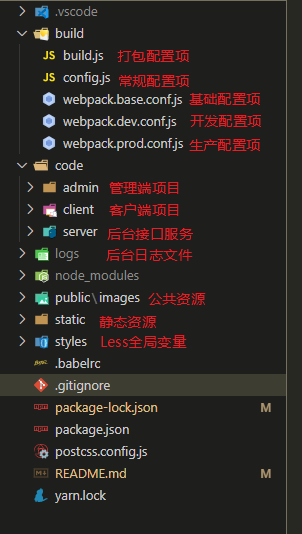

# vue-node-mongodb-blog

一款简约版本的 PC 博客。前端项目主要是采用 Vue2 和 Element-UI 来搭建的；采用 Webpack5 来构建、打包。后端项目主要采用 Node 框架 Koa2 以及 MongoDB 数据库来设计的。

1. 项目线上预览地址：[http://www.rasblog.com](http://www.rasblog.com)
2. Vue3 Vite2 H5 版本仓库地址：[https://github.com/Sujb-sus/vue3-vite2-ts-blog-h5](https://github.com/Sujb-sus/vue3-vite2-ts-blog-h5)
3. React Hooks H5 版本仓库地址：[https://github.com/Sujb-sus/react-hooks-blog-h5](https://github.com/Sujb-sus/react-hooks-blog-h5)

## 主要功能

### 客户端

1. 文章功能：文章内容支持`Markdown`语法且代码高亮展示；
2. 标签功能：通过标签分类来检索文章数据；
3. 侧边栏功能：点击排行、站长推荐和标签分类等；
4. 搜索功能：通过关键词检索文章的标题和摘要，并支持搜索高亮；
5. 留言功能：可点赞、回复评论，统计评论以及回复总数，支持`Emoji`表情；
6. 其他功能：图片懒加载、分页、侧边栏吸顶以及一键置顶等；

### 管理端

1. 权限管理：CRUD 管理员，可分配权限；
2. 文章管理：CRUD 文章，文章封面支持本地上传、文章内容支持`Markdown`语法编辑；
3. 标签管理：CRUD 标签，标签背景色支持用`Vue-Color`插件自定义选择；
4. 留言管理：RD 评论以及回复；

## 项目结构



## 技术运用

#### 一. 自动化导入大量公共组件

1. 在`components/common/index.js`文件下通过`require.context('文件路径', '是否遍历文件子目录', '匹配文件的正则')`方法导入所有公共`vue`组件

```js
// components/common/index.js
import Vue from "vue";
// 检索当前目录的vue文件且遍历子文件夹目录
const componentsContext = require.context("./", true, /.vue$/);
componentsContext.keys().forEach((component) => {
  // 获取文件中的 default 模块
  const componentConfig = componentsContext(component).default;
  componentConfig.name && Vue.component(componentConfig.name, componentConfig);
});
```

2. 在`main.js`导入`components/common/index.js`即可

```js
import "src/components/common/index.js";
```

3. 这样所有`components/common`文件下的 vue 组件都被自动导入了，可在模板直接用组件，不需要在额外导入

#### 二. 图片懒加载

原理：其实就是利用了`img`标签的`src`属性，我们先把所有图片的`url`置空，这样浏览器就不会去请求了；然后写个事件去监听可视区的范围；在进入该范围前拿到图片的`url`，在把它放到`src`属性中显示出来。

1. 安装`vue-lazyload`插件

```js
yarn add vue-lazyload -S
```

2. 在`main.js`导入`vue-lazyload`

```js
import VueLazyload from "vue-lazyload";
const loadimage = require("./images/loading.gif");
const errorimage = require("./images/load-error.jpeg");
Vue.use(VueLazyload, {
  preLoad: 1.3, // 提前加载高度（1 表示 1 屏的高度）
  error: errorimage, // 加载失败时显示的图片
  loading: loadimage, // 加载状态中显示的图片
  attempt: 1, // 加载错误后最大尝试次数
});
```

3. 将`img`标签的`src`属性直接替换为`v-lazy`即可

```html

```

#### 三. Vue-Color 自定义选择颜色

1. 安装`vue-color`插件

```js
yarn add vue-color -S
```

2. 在组件内导入、解构出`Sketch`，并注册为组件便可运用

```html
<sketch-picker v-model="currentColor" @input="colorValueChange"></sketch-picker>
```

```js
import { Sketch } from "vue-color";
export default {
  name: "permissionAdd",
  components: {
    "sketch-picker": Sketch,
  },
  data() {
    return {
      currentColor: "rgba(70, 70, 70, 0.9)",
    };
  },
  methods: {
    // 颜色值改变事件处理，fmtObj可返回16进制、rgba等格式
    colorValueChange(fmtObj) {
      // 取颜色对象的 rgba 值
      const { r, g, b, a } = fmtObj.rgba;
      this.currentColor = `rgba(${r}, ${g}, ${b}, ${a})`;
    },
  },
};
```

#### 四. Less 全局变量导入

1. 安装`style-resources-loader`插件

```js
yarn add style-resources-loader -D
```

2. 在`webpack`的`module`模块对后缀名为`less`的文件进行配置

```js
module.exports = {
  module: {
    rules: [
      // 开发环境使用vue-style-loader可以重载样式模块
      {
        test: /\.less$/,
        use: [
          !isProd
            ? { loader: "vue-style-loader" }
            : MiniCssExtractPlugin.loader,
          { loader: "css-loader" },
          { loader: "less-loader" },
          {
            loader: "style-resources-loader",
            options: {
              patterns: path.resolve(__dirname, "../styles/theme.less"),
            },
          },
        ],
      },
    ],
  },
};
```

3. 这里有个缺点就是，修改了样式需要手动刷新页面，所以开发环境可以配合`vue-style-loader`使用，就可以重载样式模块

#### 五. 支持 Markdown 语法

1. 安装`marked`和`highlightJs`插件

```js
yarn add marked highlightJs -S
```

2. 在组件内导入，通过计算属性将输入的文本格式转化为`markdown`语法

```html
<textarea v-model="val"></textarea>
<div v-html="renderHtml"></div>
```

```js
import marked from "marked";
import highlightJs from "highlight.js";

export default {
  computed: {
    renderHtml() {
      marked.setOptions({
        renderer: new marked.Renderer(),
        gfm: true, //允许 Git Hub标准的markdown.
        tables: true, //允许支持表格语法。该选项要求 gfm 为true。
        breaks: true, //允许回车换行。该选项要求 gfm 为true。
        pedantic: false, //尽可能地兼容 markdown.pl的晦涩部分。不纠正原始模型任何的不良行为和错误。
        sanitize: true, //对输出进行过滤（清理），将忽略任何已经输入的html代码（标签）
        smartLists: true, //使用比原生markdown更时髦的列表。 旧的列表将可能被作为pedantic的处理内容过滤掉.
        smartypants: false, //使用更为时髦的标点，比如在引用语法中加入破折号。
        highlight: function(code) {
          return highlightJs.highlightAuto(code).value;
        },
      });
      return marked(this.val);
    },
  },
  data() {
    return {
      val: this.value,
    };
  },
};
```

#### 六. 介绍 Webpack5 的基础配置

1. [Webpack5 常用的 Plugin ~](https://zhuanlan.zhihu.com/p/421179114)
2. [Webpack5 常用的 Loader ~](https://zhuanlan.zhihu.com/p/421176554)

#### 七. 项目部署线上流程

1. [项目在 CentOS8.2 服务器上部署到宝塔 Linux 面板整体流程 ~](https://zhuanlan.zhihu.com/p/405941407)

## 注意事项：

1. 项目启动前，需要在本地安装好 MongoDB 数据库
2. 在`code/server/config.js`文件配置数据库名、用户以及密码等一些必要的信息；这些信息都可以自定义，但是需要跟`步骤 3`同步起来

```js
// code/server/config.js
export default {
  env: process.env.NODE_ENV,
  port,
  auth,
  log,
  mongodb: {
    username: "wall", // 数据库用户
    pwd: 123456, // 数据库密码
    address: "localhost:27017",
    db: "wallBlog", // 数据库名
  },
};
```

3. 启动本地的`mongo`服务，给数据库初始化在`code/server/config.js`配置的一些必要信息

```js
> mongo // 开启mongo服务
> show dbs // 显示数据库列表
> use wallBlog // 新建一个wallBlog数据库
> db.createUser({user:"wall",pwd:"123456",roles:[{role:"readWrite",db:'wallBlog'}]}) // 在wallBlog数据库创建一个wall用户，密码为123456
> show users // 展示该库有哪些用户
> db.auth("wall", "123456"); // 数据库认证一下用户、密码，返回 1 认证成功
```

4. 登录管理后台时，需要给数据库创建`users`集合，并注册一个账号进行登录

```js
> mongo // 开启mongo服务
> show dbs // 显示数据库列表
> use wallBlog // 进入到wallBlog数据库
> db.users.insert({  // 往该库的users集合插入一条数据，账号：admin  密码：123456
    "pwd" : "e10adc3949ba59abbe56e057f20f883e",
    "username" : "admin",
    "roles" : [
        "admin"
    ]
})
> show collections // 查询该库下的集合（类似于mysql的表）
> db.users.find() // 查询users集合下的所有数据
```

5. 初始化好了数据库就可以开启后台接口服务`yarn server`，数据库如果连接成功会在控制台打印提示
6. `yarn dev:admin`启动管理后台界面，用上面注册的账号密码登录，就可以添加数据了
7. `yarn dev:client`启动客户端页面预览

## 脚本命令

- `yarn dev:admin` // 本地开发管理端页面
- `yarn dev:client` // 本地开发客户端页面
- `yarn build:admin` // 项目打包 - 管理端
- `yarn build:client` // 项目打包 - 客户端
- `yarn analyz` // 查看打包信息
- `yarn server` // 启动后台接口服务

## 参考目录

1. `vue-node-blog` 开源项目：[https://github.com/cd-dongzi/vue-node-blog](https://github.com/cd-dongzi/vue-node-blog)
2. `vue-color`文档：[https://www.npmjs.com/package/vue-color](https://www.npmjs.com/package/vue-color)
3. `vue-lazyload`文档：[https://www.npmjs.com/package/vue-lazyload](https://www.npmjs.com/package/vue-lazyload)
